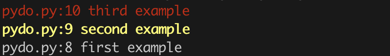

# pydo

List all TODOs in your source code.

## Quick Start

```console
python pydo.py ./pydo.py
```



**Control the urgency with the TODO format in the source code:**

```txt
# TODO: first example
# TODOO: second example
# TODOOO: third example
```
